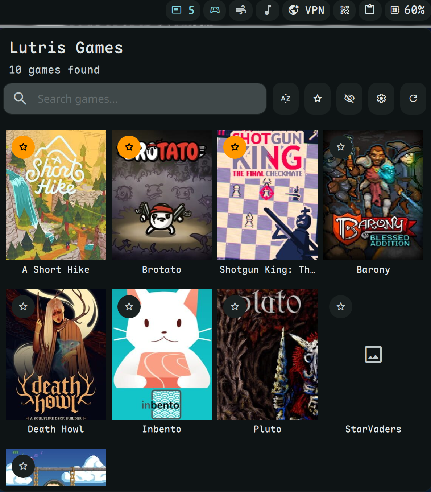

# Lutris Launcher Plugin

A modern, clean, and essential plugin for DankMaterialShell (DMS) that allows you to list and launch your installed Lutris games directly from the shell bar with a highly interactive grid interface.



## Features

### ✨ Modern & Clean UI
- **Consolidated Controls**: Search, Sort, Favorites, Blacklist, and Refresh are all unified in a single, streamlined control row.
- **Minimalist Banner Design**: Removed redundant play buttons. The game banner *is* the button.
- **Responsive Grid**: Beautiful 4-column layout that adapts to your DMS theme.

### 🎮 Smart Interactions
- **Left-Click**: Instant game launch.
- **Right-Click**: Opens an integrated **InfoPanel** overlay directly on the banner to view:
  - Last played date.
  - Total play count.
  - Quick Hide/Unhide options.
- **Visual Feedback**: 
  - **Scale Animation**: Cards shrink slightly when clicked for a physical feel.
  - **Pulse Animation**: The banner "breathes" with a subtle glow while the game is launching.
  - **Interaction Locking**: Prevents accidental multiple launches by disabling cards until the process is complete.

### 🛡️ Blacklist & Organization
- **Easy Hiding**: Hide unwanted games via the right-click menu.
- **Blacklist Mode**: Dedicated view to see only hidden games for easy management.
- **Favorites Integration**: Hidden games are automatically unhidden if favorited. Favorites are protected and cannot be hidden.
- **Advanced Sorting**: Sort by Name, Recently Played, or Most Played.

### ⚙️ Customizable Settings
- **Date Formatting**: Choose how "Last Played" is displayed (YYYY-MM-DD, DD/MM/YYYY, or ultra-concise Relative time like `2d ago`).
- **One-Click Access**: Quick settings shortcut directly from the main interface.

## Requirements
- `lutris` CLI must be installed (`/usr/bin/lutris`).
- Quickshell and DMS framework.

## Installation
1. Copy the `dms-lutris-launcher` folder to your DMS plugins directory:
   ```bash
   cp -r dms-lutris-launcher ~/.config/DankMaterialShell/plugins/
   ```
2. Restart DMS or reload plugins.

## Technical Details
- **Robust Data Handling**: Uses deep-copying of game models to ensure banner stability during sorting and filtering.
- **Detached Execution**: Uses `nohup` for game launching, ensuring games stay open even after the shell widget closes.
- **Clean API**: Filters out inconsistent Lutris CLI logs to parse JSON data reliably.

## License
GNU GPLv3
